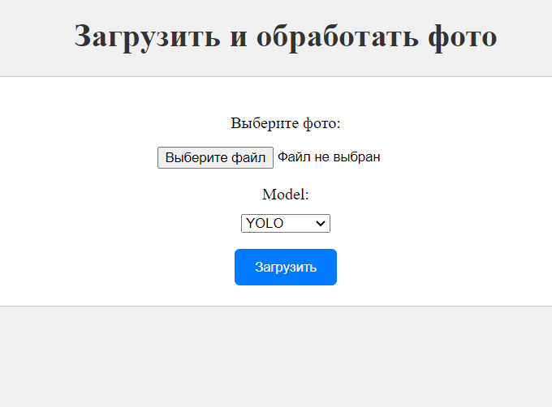
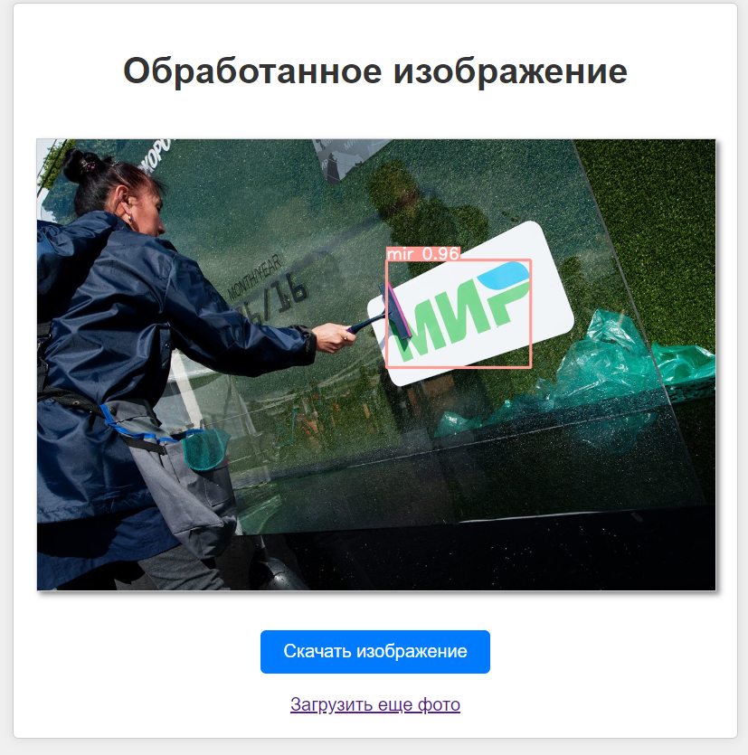

<a name="readme-top"></a>


[![Contributors][contributors-shield]][contributors-url]


<br />
<div align="center">
  <a href="https://github.com/DmitryGET/cl-search-graphic-objects">
    
  </a>

  <h3 align="center">Автоматизированный поиск графических объектов</h3>
</div>


<!-- ABOUT THE PROJECT -->
## О проекте

Задача обнаружения заданного графического объекта в изображении является практически важной, используется в анализе популярности бренда, проверке нарушений авторских прав, проверке выполнения требований законодательства, ограничивающего определенный графический и видео контент и пр. Ручной поиск таких изображений затратен по времени, велика вероятность человеческой ошибки. Поэтому разработка автоматизированных систем обнаружения становится важной задачей. Такие системы могут использовать алгоритмы компьютерного зрения и нейронные сети для точного и быстрого выявления заданных графических объектов, что повышает эффективность процесса и уменьшает вероятность ошибок.


<p align="right">(<a href="#readme-top">back to top</a>)</p>


### Стэк

* 
* 
* 
* 
* 
* 

<p align="right">(<a href="#readme-top">back to top</a>)</p>


## Подготовка

### Установка и запуск API

1. Склонировать репозиторий
   ```sh
   git clone https://github.com/DmitryGET/cl-search-graphic-objects.git
   ```
2. Зайти в папку backend
3. Создать виртуальное окружение
   ```sh
   python -m venv venv
   ```
4. Активировать его
   ```sh
   .\venv\Scripts\activate
   ```
5. Установить зависимости
   ```sh
   pip install -r  requirements.txt
   ```
6. Запустить сервер и перейти по адресу
   ```sh
   python manage.py runserver
   ```
7. Выбрать 
   ```sh
   http://127.0.0.1:8000/photo_processing/upload_photo/
   ```

<div align="center">
  
  
</div>

<p align="right">(<a href="#readme-top">back to top</a>)</p>


## Требования

* ##### OS (Windows (10, 8.1, 8), Linux, MacOS)
* ##### Python 3.8 и выше

<p align="right">(<a href="#readme-top">back to top</a>)</p>

[contributors-shield]: https://img.shields.io/github/contributors/github_username/repo_name.svg?style=for-the-badge
[contributors-url]: https://github.com/DmitryGET/cl-search-graphic-objects/graphs/contributors
